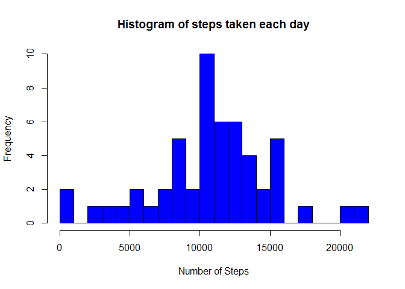
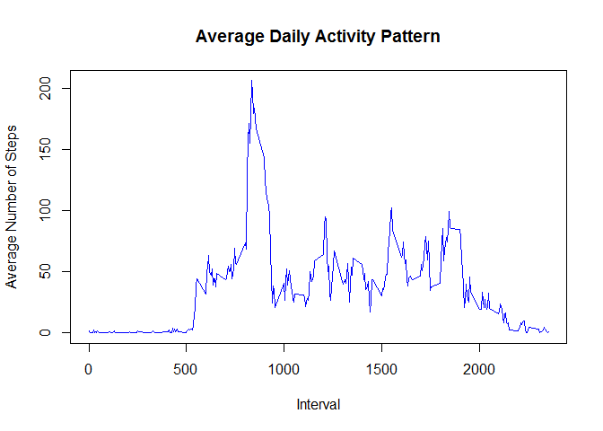
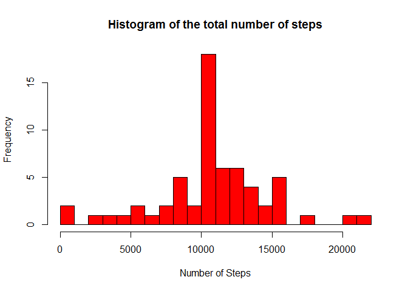

# PA1_template


```r
# Load data
data <- read.csv("activity.csv", header = TRUE, sep = ",", na.strings = "NA")

# Summarize data
summary (data)
```

```
##      steps                date          interval     
##  Min.   :  0.00   2012-10-01:  288   Min.   :   0.0  
##  1st Qu.:  0.00   2012-10-02:  288   1st Qu.: 588.8  
##  Median :  0.00   2012-10-03:  288   Median :1177.5  
##  Mean   : 37.38   2012-10-04:  288   Mean   :1177.5  
##  3rd Qu.: 12.00   2012-10-05:  288   3rd Qu.:1766.2  
##  Max.   :806.00   2012-10-06:  288   Max.   :2355.0  
##  NA's   :2304     (Other)   :15840
```

```r
str(data)
```

```
## 'data.frame':	17568 obs. of  3 variables:
##  $ steps   : int  NA NA NA NA NA NA NA NA NA NA ...
##  $ date    : Factor w/ 61 levels "2012-10-01","2012-10-02",..: 1 1 1 1 1 1 1 1 1 1 ...
##  $ interval: int  0 5 10 15 20 25 30 35 40 45 ...
```

```r
# Convert 'Date' and 'Interval' to readable forms
data$date <- as.Date(data$date, format = "%Y-%m-%d")
data$interval <- factor(data$interval)
```

# What is mean total number of steps taken per day?

```r
NA_data <- is.na(as.character(data$steps))
data_no_NA <- data[!NA_data,]
steps_each_day <- aggregate(steps ~ date, data = data_no_NA, sum)
colnames(steps_each_day) <- c("date", "steps")
```

### Histogram of the number of steps taken each day

```r
hist(as.numeric(steps_each_day$steps), breaks = 20, col = "blue", 
xlab = "Number of Steps", main= "Histogram of steps taken each day")
```

 

```r
mean(steps_each_day$steps)
```

```
## [1] 10766.19
```

```r
median(steps_each_day$steps)
```

```
## [1] 10765
```

# What is the average daily activity pattern?

```r
steps_per_interval<- aggregate(data_no_NA$steps, by=list(interval=data_no_NA$interval), FUN=mean)
colnames(steps_per_interval)<-c("interval", "average_steps")

plot(as.integer(levels(steps_per_interval$interval)), steps_per_interval$average_steps, type="l", 
xlab = "Interval", ylab = "Average Number of Steps", main = "Average Daily Activity Pattern", col="blue")
```

 

## 5-minute interval that contains the maximum number of steps:
  
###The maximum number of average steps

```r
max_steps <- max(steps_per_interval$average_steps)
max_steps
```

```
## [1] 206.1698
```

###The 5-minute interval that contains the maximum number of steps

```r
interval_max_steps<-steps_per_interval[which.max(steps_per_interval$average_steps),]$interval
interval_max_steps
```

```
## [1] 835
## 288 Levels: 0 5 10 15 20 25 30 35 40 45 50 55 100 105 110 115 120 ... 2355
```

#Imputing missing values


```r
sum(is.na(as.character(data$steps)))
```

```
## [1] 2304
```

```r
sum(is.na(as.character(data$date)))
```

```
## [1] 0
```

```r
sum(is.na(as.character(data$interval)))
```

```
## [1] 0
```

```r
##finding the indices of missing values (NAs)
NA_index <- which(is.na(as.character(data$steps)))
complete_data <- data
##Imputing missing values using the mean for that 5-minute interval
complete_data[NA_index, ]$steps<-unlist(lapply(NA_index, FUN=function(NA_index){
  steps_per_interval[data[NA_index,]$interval==steps_per_interval$interval,]$average_steps
}))
```

## Summarize new data

```r
summary(complete_data)
```

```
##      steps             date               interval    
##  Min.   :  0.00   Min.   :2012-10-01   0      :   61  
##  1st Qu.:  0.00   1st Qu.:2012-10-16   5      :   61  
##  Median :  0.00   Median :2012-10-31   10     :   61  
##  Mean   : 37.38   Mean   :2012-10-31   15     :   61  
##  3rd Qu.: 27.00   3rd Qu.:2012-11-15   20     :   61  
##  Max.   :806.00   Max.   :2012-11-30   25     :   61  
##                                        (Other):17202
```

```r
str(complete_data)
```

```
## 'data.frame':	17568 obs. of  3 variables:
##  $ steps   : num  1.717 0.3396 0.1321 0.1509 0.0755 ...
##  $ date    : Date, format: "2012-10-01" "2012-10-01" ...
##  $ interval: Factor w/ 288 levels "0","5","10","15",..: 1 2 3 4 5 6 7 8 9 10 ...
```

```r
steps_each_day_complete <- aggregate(steps ~ date, data = complete_data, sum)
colnames(steps_each_day_complete) <- c("date", "steps")
```

#Make histogram of the number of steps taken

```r
hist(as.numeric(steps_each_day_complete$steps), breaks = 20, col = "red", xlab = "Number of Steps", main= "Histogram of the total number of steps")
```

 

```r
mean(steps_each_day_complete$steps)
```

```
## [1] 10766.19
```

```r
median(steps_each_day_complete$steps)
```

```
## [1] 10766.19
```

# Are there differences in activity patterns between weekdays and weekends?

##Creating a factor variable "day "to store the day of the week:

```r
complete_data$day <- as.factor(weekdays(complete_data$date))
```

##Creating a logical variable :

```r
complete_data$is_weekday <- ifelse(!(complete_data$day %in% c("Saturday","Sunday")), TRUE, FALSE) 
```

##Calculating the average number of steps for weekdays

```r
weekdays_data <- complete_data[complete_data$is_weekday,]
steps_per_interval_weekdays <- aggregate(weekdays_data$steps, by=list(interval=weekdays_data$interval), FUN=mean)
```

##Calculating the average number of steps for weekends

```r
weekends_data <- complete_data[!complete_data$is_weekday,]
steps_per_interval_weekends <- aggregate(weekends_data$steps, by=list(interval=weekends_data$interval), FUN=mean)
```

#Adding columns names

```r
colnames(steps_per_interval_weekdays) <- c("interval", "average_steps")
colnames(steps_per_interval_weekends) <- c("interval", "average_steps")
steps_per_interval_weekdays$day <- "Weekday"
steps_per_interval_weekends$day <- "Weekend"
week_data <- rbind(steps_per_interval_weekends, steps_per_interval_weekdays)
week_data$day <- as.factor(week_data$day)
```

## Make plot

```r
library(lattice)
xyplot(average_steps ~  interval | day, data = week_data, layout = c(1,2), type ="l", ylab="Number of Steps")
```

 

